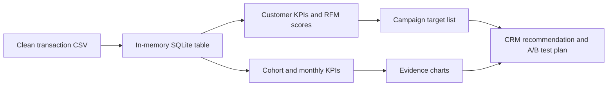

# Customer Retention: From SQL Analysis to CRM Decision

Portfolio project based on the UCI Online Retail II transaction dataset. The project answers a practical CRM question and turns the answer into a prioritised campaign list, supporting evidence, and a measurement plan.

## The business question

> A UK online retailer has a limited retention-campaign budget. Which existing customers should be prioritised, and how should the campaign be evaluated?

## Executive recommendation

Prioritise the **At Risk High Value** segment first: customers with meaningful historical spend who have not purchased recently. The analysis identifies **397 customers** in this segment, representing **GBP 1.47m of historical revenue**. A ranked list of **300 customers** is provided as a practical campaign test population.

This is a prioritisation hypothesis, not proof that a campaign will cause additional revenue. The recommended next step is a treatment/control test with a fixed measurement window.

## KPI snapshot

| Metric | Result | Why it matters |
| --- | ---: | --- |
| Known customers | 5,878 | Addressable customer base after cleaning |
| Orders | 36,969 | Transaction scale used for customer-level analysis |
| Clean revenue | GBP 17.7m | Historical value available for segmentation |
| Repeat-customer rate | 72.4% | Shows that repeat purchasing is commercially important |
| At Risk High Value customers | 397 | Customers with high historical value but low recent activity |
| At Risk High Value revenue | GBP 1.47m | Historical value associated with the retention opportunity |
| Prioritised campaign list | 300 | Manageable population for a controlled test |
| Average M+1 to M+3 retention | 21.6% | Evidence that post-first-purchase retention drops materially |

Analysis date: **2011-12-10**, set as one day after the latest transaction in the cleaned dataset.

## Evidence for the decision

### Historical value is concentrated, while the retention opportunity is specific


The revenue chart separates the largest value pools from the segment selected for intervention. The target is not “every inactive customer”; it is the subset where inactivity and historical value overlap.

### Monthly performance is volatile, so customer-level prioritisation matters


Monthly KPIs provide context, but they do not identify who should receive a campaign. That is why the decision uses customer-level recency, frequency, and monetary value.

### Retention weakens after the first purchase month


The cohort view supports a lifecycle intervention: measure whether targeted customers return during a defined post-campaign window rather than judging the campaign only on immediate revenue.

### The recommendation turns a broad dataset into a testable action


The funnel shows the decision logic: start with the known customer base, isolate the high-value inactive segment, then rank a manageable campaign population.

## Data-to-decision workflow



The analysis is reproducible: the same SQL outputs feed both the static GitHub figures and the HTML dashboard. The project uses an in-memory SQLite database during the build; it does not claim to deploy a production database.

## How the analysis supports a business decision

1. **Clean the transaction data** by removing cancelled or unusable records in the upstream cleaning step and excluding incomplete customer records from the analytical table.
2. **Aggregate at order and customer level** so revenue, order frequency, average order value, and recency are commercially interpretable.
3. **Segment customers with RFM logic** using recency, frequency, and monetary scores.
4. **Use a decision rule** in [`04_campaign_targets.sql`](sql/04_campaign_targets.sql): low recency, high monetary value, and at least two historical orders.
5. **Rank the eligible population** so the output can be handed to a CRM or marketing team rather than stopping at a descriptive chart.
6. **Measure incrementality** with treatment and control groups using repeat purchase rate, revenue per customer, and average order value.

The SQL also demonstrates the role of filtering at different stages. For example, [`06_repeat_customer_summary.sql`](sql/06_repeat_customer_summary.sql) uses `WHERE` to exclude incomplete records before aggregation and `HAVING` to retain customers with at least two orders. The clauses are tied to the business question rather than added only for syntax coverage.

## Outputs

- [`outputs/executive_summary.md`](outputs/executive_summary.md) — generated one-page decision summary.
- [`dashboard/customer_retention_dashboard.html`](dashboard/customer_retention_dashboard.html) — generated dashboard with KPI cards, segment bars, target rows, and cohort heatmap.
- [`outputs/campaign_targets.csv`](outputs/campaign_targets.csv) — ranked list of 300 campaign candidates.
- [`outputs/rfm_segment_summary.csv`](outputs/rfm_segment_summary.csv) — segment-level customer and revenue summary.
- [`outputs/monthly_kpis.csv`](outputs/monthly_kpis.csv) — monthly revenue, order, customer, AOV, and repeat-purchase KPIs.
- [`documentation/figures/`](documentation/figures/) — static SVG charts embedded above for GitHub viewing.

## Reproduce the analysis

The build expects the cleaned transaction file from the companion cleaning project by default:

```text
../SQL_Study_package/day1_customer_retention_learning_pack/outputs/clean_transactions.csv
```

Run:

```bash
pip install -r requirements.txt
python scripts/build_customer_retention_outputs.py
```

To use another cleaned CSV, update `DEFAULT_INPUT` in the build script or call the loading function from a small wrapper. The expected columns are documented in [`documentation/data_dictionary.md`](documentation/data_dictionary.md).

## Repository map

```text
sql/                 business questions expressed as SQL transformations
scripts/             reproducible output and chart generation
outputs/             CSV extracts, metrics, and executive summary
documentation/       business brief, analysis notes, data dictionary, figures
dashboard/           generated HTML dashboard
```

## Limitations and next steps

- Transaction history shows association, not campaign causality.
- The prioritisation uses revenue rather than profit because margin and campaign cost are not available.
- Customers without a usable customer ID are excluded from customer-level targeting.
- The next production step would be to add campaign history, margin, channel permissions, contact cost, and a persisted CRM-ready table.
