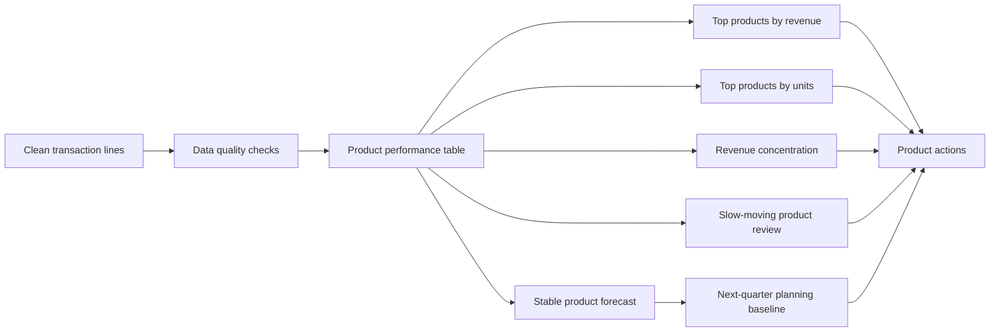

# Online Retail Product Sales and Demand Analysis

A UK online retailer has two years of order-line history. Each row records a product sold within an invoice: what was sold, how many units were bought, when it was bought, at what price, and by which customer ID.

The business question is:

> Which products are driving sales, which products are slowing down, and what should the business plan for next quarter?

This report focuses on product sales and demand. Customer IDs are used only as purchase-behaviour context, because the dataset does not contain demographic customer information such as age, gender, occupation, membership tier or marketing channel.

## Data Overview

The project uses the UCI Online Retail II dataset, cleaned into transaction-line records for analysis.

| Dataset feature | Value |
|---|---:|
| Transaction period | 2009-12-01 to 2011-12-09 |
| Clean transaction lines | 793,609 |
| Distinct orders | 36,969 |
| Known customers | 5,878 |
| Stock codes | 4,631 |
| Merchandise products | 4,626 |
| Countries/regions | 41 |
| Clean revenue | GBP 17.7m |

The raw dataset is a sales-order table at product-line level. One invoice can appear across many rows if the customer bought multiple products in the same order.

| Layer | What it represents | Example fields |
|---|---|---|
| Transaction line | One product line inside an invoice | invoice, stock code, quantity, unit price, line value |
| Order | One completed customer purchase | invoice, customer ID, order date, order value |
| Product | One stock item aggregated across sales | units sold, revenue, orders, customers, active months |
| Planning item | A product selected for action | top seller, slow-moving candidate, forecast item |

Cleaning removed cancelled or unusable records, missing customer IDs, non-positive quantities or prices, duplicate transaction lines and rows that could not support sales analysis. Source and cleaning notes are in [`data/README.md`](data/README.md).

## Sales Trend Context

Before deciding which products to protect, promote or review, the business needs a view of overall sales movement. Monthly revenue and order volume show the trading backdrop behind the product recommendations.


The monthly pattern is not flat, so product decisions should be reviewed with timing and seasonality in mind. This is why the report separates historical product ranking from the next-quarter planning baseline.

## Executive Recommendation

The business should manage products in four groups:

1. **Protect stock for high-revenue products.** These products drive income and need availability planning.
2. **Use high-unit products for bundles and add-ons.** Some products sell many units but generate lower revenue, so they can support basket-building.
3. **Review slow-moving products before discounting or delisting.** Several products have meaningful historical revenue but no sale for at least 180 days.
4. **Forecast only stable high-revenue products individually.** The full catalogue is too sparse and long-tailed for useful product-by-product forecasting.

## What the Product Catalogue Looks Like

The catalogue is broad and long-tailed. Many products sell only intermittently, while a smaller group sells consistently across many months.


Important patterns:

- There are **4,626 merchandise products** after excluding service/admin lines such as postage and manual adjustments.
- The top **10** merchandise products account for **8.1%** of merchandise revenue.
- The top **100** merchandise products account for **29.8%** of merchandise revenue.
- The top **500** merchandise products account for **64.0%** of merchandise revenue.
- This means the business has a meaningful core range, but also a large long tail that should not be forecast or managed product-by-product in the same way.

## Top Products by Revenue

Revenue ranking identifies products that matter most commercially. These should be protected from stockouts and reviewed for margin, placement and promotion.


The top revenue product is **REGENCY CAKESTAND 3 TIER** (`22423`), generating **GBP 285,992** from **24,858 units**.

## Top Products by Units Sold

Unit ranking tells a different story. These products create volume and basket activity, but they are not always the highest revenue drivers.


The top unit product is **WORLD WAR 2 GLIDERS ASSTD DESIGNS** (`84077`), with **108,929 units** sold but only **GBP 24,844** in revenue. This is a useful candidate for basket-building, add-on offers or volume-led merchandising rather than premium revenue focus.

## Products That Need Review

Slow-moving products are not simply products with low sales. This report flags products with meaningful historical revenue but no sale for at least 180 days.


These products should be reviewed before taking action:

- If stock remains, consider clearance, bundling or targeted promotion.
- If the product is discontinued, remove it from active planning assumptions.
- If the product was seasonal, compare it against the same season before treating it as weak demand.

The generated list is in [`outputs/slow_moving_product_candidates.csv`](outputs/slow_moving_product_candidates.csv).

## Next-Quarter Product Forecast

Forecasting every product would be misleading because many products are sparse, seasonal or discontinued. Instead, the forecast is limited to stable high-revenue merchandise products.

The current baseline uses the average of the last four quarters. For the top 20 stable products, the next-quarter baseline for **2012-Q1** is:

| Forecast scope | Baseline |
|---|---:|
| Products forecast individually | 20 |
| Forecast units | 76,320 |
| Forecast revenue | GBP 205,589 |


This is a planning baseline, not a production demand model. It is useful for identifying where a buyer, merchandising or operations team should start reviewing stock and promotion plans.

## Customer Purchase Behaviour as Context

The dataset has `customer_id`, so customer behaviour can help explain demand breadth, but it should not be treated as demographic profiling.

Useful customer-related questions include:

- How many unique customers bought each product?
- Are high-revenue products bought by many customers or a small number of buyers?
- Which products appear in many orders and support basket-building?
- Which products are associated with repeat purchasing?

For example, **WHITE HANGING HEART T-LIGHT HOLDER** (`85123A`) appears in **4,895 orders** and reaches **1,490 customers**, making it both a high-revenue product and a broad-demand product.

## Data Quality Checks

Before product analysis, the cleaned table is checked across six dimensions.

| Dimension | Check | Result |
|---|---|---|
| Accuracy | Line value matches quantity times price | Pass |
| Validity | Transaction values are positive and usable | Pass |
| Timeliness | No transactions after the analysis date | Pass |
| Completeness | Required fields are populated | Pass |
| Consistency | Invoices map to one customer | Pass |
| Uniqueness | No exact duplicate transaction lines | Pass |

Generated results: [`outputs/data_quality_checks.csv`](outputs/data_quality_checks.csv).

## Analytical Outputs

Main product outputs:

- [`outputs/product_performance.csv`](outputs/product_performance.csv) - product-level units, revenue, orders, customers and active months.
- [`outputs/product_revenue_concentration.csv`](outputs/product_revenue_concentration.csv) - Top 10/50/100/500 revenue concentration.
- [`outputs/top_products_by_revenue.csv`](outputs/top_products_by_revenue.csv) - Top 10 merchandise products by revenue.
- [`outputs/top_products_by_quantity.csv`](outputs/top_products_by_quantity.csv) - Top 10 merchandise products by units sold.
- [`outputs/slow_moving_product_candidates.csv`](outputs/slow_moving_product_candidates.csv) - products with historical revenue but no recent sales.
- [`outputs/product_next_quarter_forecast.csv`](outputs/product_next_quarter_forecast.csv) - next-quarter baseline for stable high-revenue products.
- [`outputs/executive_summary.md`](outputs/executive_summary.md) - generated report summary.

Supporting outputs:

- [`outputs/monthly_kpis.csv`](outputs/monthly_kpis.csv) - monthly revenue, orders, customers and repeat-purchase context.
- [`outputs/customer_metrics.csv`](outputs/customer_metrics.csv) - customer purchase behaviour metrics.
- [`outputs/data_quality_checks.csv`](outputs/data_quality_checks.csv) - generated quality checks.

## Data-to-Decision Workflow



## Reproduce the Analysis

The build expects the cleaned transaction file from the companion cleaning project by default:

```text
../SQL_Study_package/day1_customer_retention_learning_pack/outputs/clean_transactions.csv
```

Run:

```bash
pip install -r requirements.txt
python scripts/build_customer_retention_outputs.py
```

The script generates SQL outputs, product CSVs, the HTML dashboard, SVG figures and the executive summary.

## Limitations and Next Steps

- The dataset contains product and transaction behaviour, not customer demographic attributes.
- Revenue is used instead of profit because product cost and margin are not available.
- Stock levels are not available, so slow-moving analysis cannot confirm whether a product was unavailable or simply not demanded.
- Forecasting is limited to stable high-revenue products; sparse long-tail products should be managed by category or lifecycle rules.
- A production version should add inventory, margin, product category, promotion history and current stock availability.
