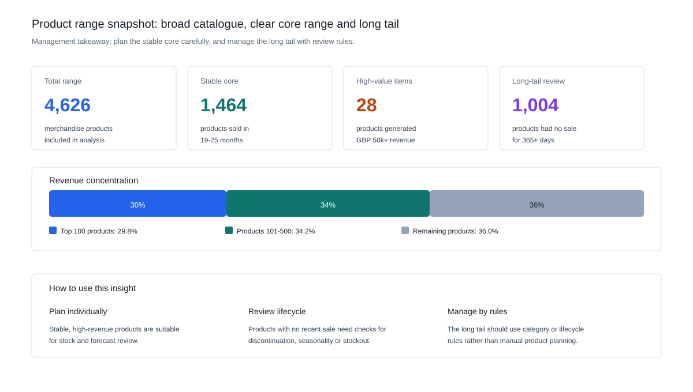
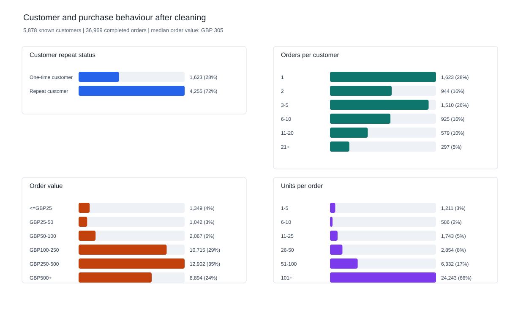
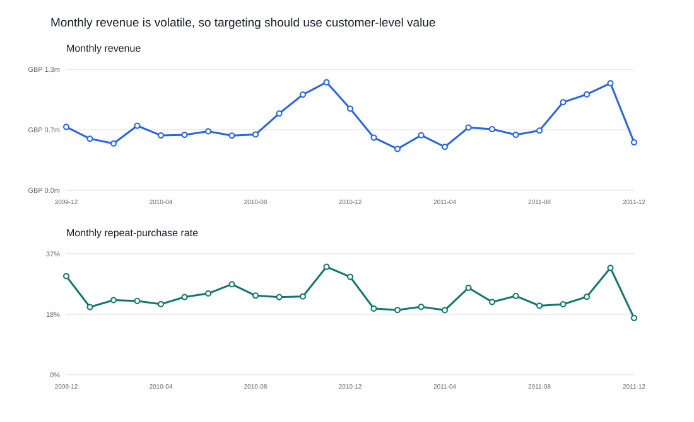
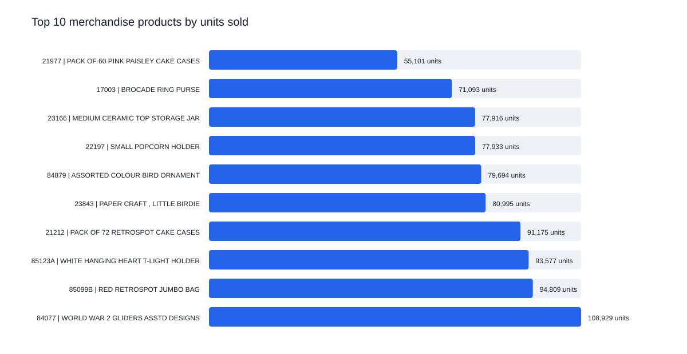
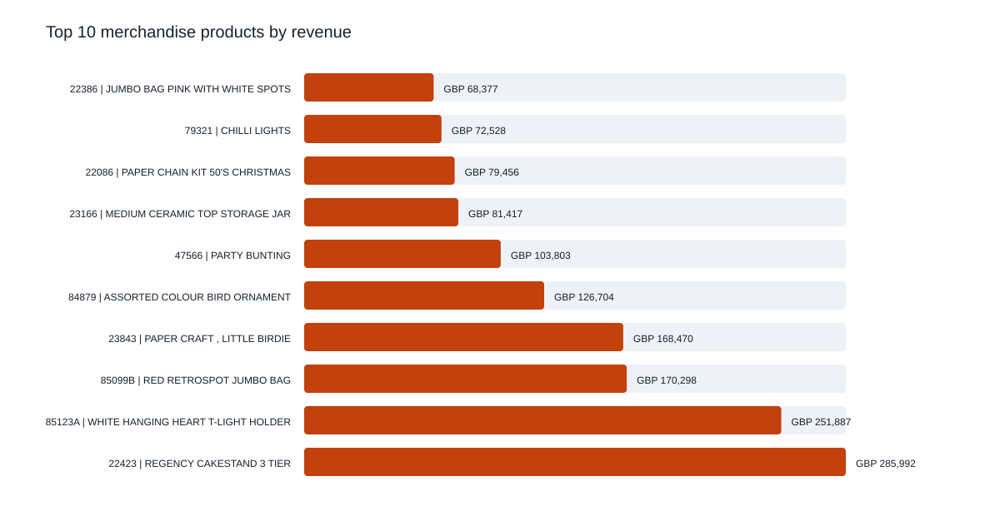
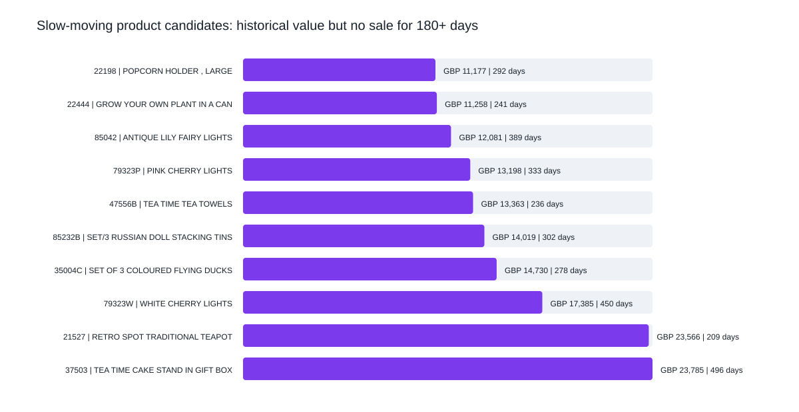
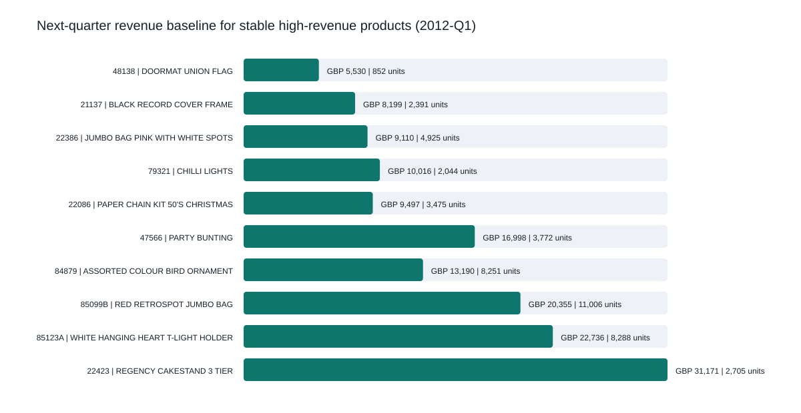
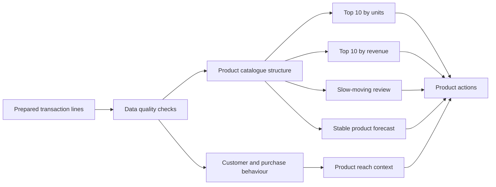

# Online Retail Product Sales and Demand Analysis

A UK online retailer has two years of order-line sales history. Each row records one product line inside an invoice: what was sold, how many units were bought, when it was bought, at what price, and by which customer ID.

The business question is:

> Using the prepared transaction data, what products does the business sell, what do customer purchases look like, which products sell best, and what should the business plan for next quarter?

## Analysis Base

The analysis below is based on the prepared UCI Online Retail II transaction dataset.

| Analysis base | Value |
|---|---:|
| Sales period analysed | 2009-12-01 to 2011-12-09 |
| Transaction lines analysed | 793,609 |
| Completed orders analysed | 36,969 |
| Known customers represented | 5,878 |
| Merchandise products analysed | 4,626 |
| Countries/regions represented | 41 |
| Revenue analysed | GBP 17.7m |

## 1. Product Range Analysed

The first question is whether this is a small stable product range or a broad catalogue with a long tail. The answer affects how the business should manage stock, promotions and forecasting.

| Management question | Evidence | Meaning |
|---|---:|---|
| How broad is the range? | 4,626 merchandise products | Product management needs prioritisation, not equal attention for every item. |
| Is there a stable core? | 1,464 products sold in 19-25 months | These products are better candidates for stock planning and forecasting. |
| Is there a long tail? | 1,004 products had no sale for 365+ days | These products need lifecycle review before being kept in active planning. |
| Where is revenue concentrated? | Top 500 products generate 64.0% of merchandise revenue | Management focus should start with the products that drive most revenue. |



Key interpretation:

- The retailer has a broad catalogue, not a small fixed product set.
- A stable core range can be planned product by product.
- The long tail should be managed through review rules, lifecycle decisions and category-level assumptions.

## 2. Customer and Purchase Behaviour

Customer analysis here is based on observed purchases: repeat status, order frequency, order value and basket size.

| Behaviour metric | Finding |
|---|---:|
| Known customers | 5,878 |
| One-time customers | 1,623 |
| Repeat customers | 4,255 |
| Repeat customer share | 72.4% |
| Median orders per customer | 3 |
| Median customer revenue | GBP 887 |
| Median order value | GBP 305 |
| Median units per order | 154 |
| Median distinct products per order | 15 |



What this shows:

- Most known customers placed more than one order, so product demand is not only from one-off buyers.
- Orders are often multi-item baskets: the median order contains 15 distinct products.
- This makes product reach useful: a product bought by many customers and appearing in many orders is more reliable than a product driven by one unusually large order.

## 3. Monthly Sales Context

Before ranking individual products, it helps to see the overall sales pattern.



The monthly pattern is not flat. Product decisions should therefore consider timing and seasonality, especially for slow-moving products and next-quarter planning.

## 4. Top 10 Best-Selling Products

The table below ranks products by units sold. This answers: which products physically sold the most?



| Rank | Stock code | Product | Units sold | Revenue | Orders | Customers |
|---:|---|---|---:|---:|---:|---:|
| 1 | 84077 | WORLD WAR 2 GLIDERS ASSTD DESIGNS | 108,929 | GBP 24,844 | 920 | 482 |
| 2 | 85099B | RED RETROSPOT JUMBO BAG | 94,809 | GBP 170,298 | 3,260 | 978 |
| 3 | 85123A | WHITE HANGING HEART T-LIGHT HOLDER | 93,577 | GBP 251,887 | 4,895 | 1,490 |
| 4 | 21212 | PACK OF 72 RETROSPOT CAKE CASES | 91,175 | GBP 44,019 | 2,508 | 1,115 |
| 5 | 23843 | PAPER CRAFT, LITTLE BIRDIE | 80,995 | GBP 168,470 | 1 | 1 |
| 6 | 84879 | ASSORTED COLOUR BIRD ORNAMENT | 79,694 | GBP 126,704 | 2,652 | 1,010 |
| 7 | 22197 | SMALL POPCORN HOLDER | 77,933 | GBP 59,069 | 1,752 | 601 |
| 8 | 23166 | MEDIUM CERAMIC TOP STORAGE JAR | 77,916 | GBP 81,417 | 195 | 138 |
| 9 | 17003 | BROCADE RING PURSE | 71,093 | GBP 14,817 | 387 | 215 |
| 10 | 21977 | PACK OF 60 PINK PAISLEY CAKE CASES | 55,101 | GBP 26,656 | 1,578 | 767 |

Important reading:

- High unit volume does not always mean high revenue. `84077` sells the most units but generates much less revenue than the top revenue products.
- `23843` is a special case: it has very high units and revenue but appears in only one order from one customer. It should be reviewed as a bulk or unusual transaction before being treated as a normal bestseller.
- `85123A` is strong across units, revenue, orders and customers, making it a broad-demand product rather than a one-off spike.

## 5. Top 10 Products by Revenue

Revenue ranking answers a different question: which products matter most commercially?



| Rank | Stock code | Product | Revenue | Units sold | Orders | Customers |
|---:|---|---|---:|---:|---:|---:|
| 1 | 22423 | REGENCY CAKESTAND 3 TIER | GBP 285,992 | 24,858 | 3,317 | 1,314 |
| 2 | 85123A | WHITE HANGING HEART T-LIGHT HOLDER | GBP 251,887 | 93,577 | 4,895 | 1,490 |
| 3 | 85099B | RED RETROSPOT JUMBO BAG | GBP 170,298 | 94,809 | 3,260 | 978 |
| 4 | 23843 | PAPER CRAFT, LITTLE BIRDIE | GBP 168,470 | 80,995 | 1 | 1 |
| 5 | 84879 | ASSORTED COLOUR BIRD ORNAMENT | GBP 126,704 | 79,694 | 2,652 | 1,010 |
| 6 | 47566 | PARTY BUNTING | GBP 103,803 | 23,591 | 2,077 | 894 |
| 7 | 23166 | MEDIUM CERAMIC TOP STORAGE JAR | GBP 81,417 | 77,916 | 195 | 138 |
| 8 | 22086 | PAPER CHAIN KIT 50'S CHRISTMAS | GBP 79,456 | 29,430 | 1,691 | 896 |
| 9 | 79321 | CHILLI LIGHTS | GBP 72,528 | 15,658 | 922 | 304 |
| 10 | 22386 | JUMBO BAG PINK WITH WHITE SPOTS | GBP 68,377 | 37,680 | 1,767 | 601 |

Product action:

- Protect availability for high-revenue, broad-reach products such as `22423`, `85123A`, `85099B` and `84879`.
- Use high-unit lower-revenue products as basket builders, add-ons or bundle components.
- Review unusually concentrated products, such as products driven by one order, before using them in planning.

## 6. Products That Need Review

Slow-moving products are not simply products with low sales. This report flags products with meaningful historical revenue but no sale for at least 180 days.



These products should be reviewed before taking action:

- If stock remains, consider clearance, bundling or targeted promotion.
- If the product is discontinued, remove it from active planning assumptions.
- If the product was seasonal, compare it against the same season before treating it as weak demand.

The generated list is in [`outputs/slow_moving_product_candidates.csv`](outputs/slow_moving_product_candidates.csv).

## 7. Next-Quarter Product Forecast

Forecasting every product would be misleading because many products are sparse, seasonal or discontinued. Instead, the forecast is limited to stable high-revenue merchandise products.

The current baseline uses the average of the last four quarters. For the top 20 stable products, the next-quarter baseline for 2012-Q1 is:

| Forecast scope | Baseline |
|---|---:|
| Products forecast individually | 20 |
| Forecast units | 76,320 |
| Forecast revenue | GBP 205,589 |



This is a planning baseline, not a production demand model. It is useful for identifying where a buyer, merchandising or operations team should start reviewing stock and promotion plans.

## Recommendation

The business should manage products in four groups:

1. **Protect stock for high-revenue, broad-reach products.** These products drive income and appear across many orders/customers.
2. **Use high-unit lower-revenue products for baskets and bundles.** They can increase order size even when they are not premium revenue drivers.
3. **Review slow-moving products before discounting or delisting.** The transaction data shows lack of recent sales, but not whether the cause is stockout, discontinuation or weak demand.
4. **Forecast stable products individually and manage the long tail by rules.** The full catalogue is too sparse for reliable product-by-product forecasting.

## Data Quality Checks

Before product analysis, the analytical table is checked across six dimensions.

| Dimension | Check | Result |
|---|---|---|
| Accuracy | Line value matches quantity times price | Pass |
| Validity | Transaction values are positive and usable | Pass |
| Timeliness | No transactions after the analysis date | Pass |
| Completeness | Required fields are populated | Pass |
| Consistency | Invoices map to one customer | Pass |
| Uniqueness | No exact duplicate transaction lines | Pass |

Generated results: [`outputs/data_quality_checks.csv`](outputs/data_quality_checks.csv).

## Analytical Outputs

Main outputs:

- [`outputs/product_performance.csv`](outputs/product_performance.csv) - product-level units, revenue, orders, customers and active months.
- [`outputs/order_purchase_summary.csv`](outputs/order_purchase_summary.csv) - one row per invoice with order value, units and distinct products.
- [`outputs/customer_profile_summary.csv`](outputs/customer_profile_summary.csv) - customer purchase-behaviour distributions.
- [`outputs/purchase_behavior_summary.csv`](outputs/purchase_behavior_summary.csv) - order-value and basket-size distributions.
- [`outputs/product_revenue_concentration.csv`](outputs/product_revenue_concentration.csv) - Top 10/50/100/500 revenue concentration.
- [`outputs/top_products_by_quantity.csv`](outputs/top_products_by_quantity.csv) - Top 10 merchandise products by units sold.
- [`outputs/top_products_by_revenue.csv`](outputs/top_products_by_revenue.csv) - Top 10 merchandise products by revenue.
- [`outputs/slow_moving_product_candidates.csv`](outputs/slow_moving_product_candidates.csv) - products with historical revenue but no recent sales.
- [`outputs/product_next_quarter_forecast.csv`](outputs/product_next_quarter_forecast.csv) - next-quarter baseline for stable high-revenue products.
- [`outputs/executive_summary.md`](outputs/executive_summary.md) - generated report summary.

## Data-to-Decision Workflow



## Reproduce the Analysis

The build expects the prepared transaction file from the companion data project by default:

```text
../SQL_Study_package/day1_customer_retention_learning_pack/outputs/clean_transactions.csv
```

Run:

```bash
pip install -r requirements.txt
python scripts/build_customer_retention_outputs.py
```

The script generates SQL outputs, product CSVs, the HTML dashboard, SVG figures and the executive summary.

## Limitations and Next Steps

- The dataset contains product and transaction behaviour, not customer demographic attributes.
- The dataset does not include product category, inventory, stockout, cost or margin fields.
- Revenue is used instead of profit because product cost and margin are not available.
- Products with weak recent sales may be discontinued, seasonal or out of stock; transaction history alone cannot separate these causes.
- Forecasting is limited to stable high-revenue products; sparse long-tail products should be managed by category or lifecycle rules.
