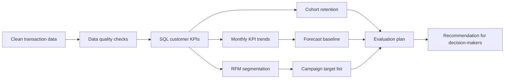

# Customer Prioritisation and Retention Insight Report

This is a portfolio analytics project that turns historical transaction data into a clear, testable recommendation:

> When resources are limited, which customers should be prioritised, and how should we check whether the action worked?

The project is deliberately written as a report first and a code project second. A non-technical reviewer can understand the problem, evidence and recommendation from this page; a technical reviewer can then inspect the SQL, generated outputs, data quality checks, forecasting extension and reproducible build script.

## What data was analysed?

This project uses the UCI Online Retail II dataset, a historical transaction dataset from a UK-based online retailer. Each row is a transaction line, not a whole order. The data includes invoice IDs, product information, quantities, transaction dates, unit prices, customer IDs and country.

For the analytical version of the project, the raw workbook was cleaned before customer-level analysis. The cleaned table used here covers:

| Dataset feature | Value |
|---|---:|
| Transaction period | 2009-12-01 to 2011-12-09 |
| Clean transaction rows | 793,609 |
| Distinct orders | 36,969 |
| Known customers | 5,878 |
| Clean revenue | GBP 17.7m |
| Analysis date | 2011-12-10 |

Cleaning removed cancelled or unusable records, missing customer IDs, non-positive quantities or prices, exact duplicates and rows that could not support customer-level targeting. The full raw workbook is not committed to this repository; the project includes code, SQL, documentation, summary outputs and visual evidence. More detail is in [`data/README.md`](data/README.md) and [`documentation/data_dictionary.md`](documentation/data_dictionary.md).

## 30-second summary

| Question | Answer |
|---|---|
| What is the practical problem? | A team has a limited retention budget and cannot contact every inactive customer. |
| What did the analysis find? | 397 customers are `At Risk High Value`, representing GBP 1.47m in historical revenue. |
| What is the recommendation? | Prioritise this segment first and use the top 300 ranked customers as a manageable test population. |
| Can the data be trusted? | The cleaned analytical table passed 6/6 data quality checks. |
| Is this proof the campaign will work? | No. The project recommends a treatment/control evaluation before claiming impact. |
| What is the short-term trend baseline? | A simple 3-month moving average forecasts GBP 903k revenue for 2012-01. |

## Recommendation

Prioritise the `At Risk High Value` segment first. These customers have meaningful historical spend but have not purchased recently, making them a stronger first test group than low-value inactive customers.

This is a prioritisation hypothesis, not proof of campaign impact. The next step is a controlled test that compares contacted customers with a similar control group over a fixed measurement window.

## Evidence

### 1. Value is concentrated, and the opportunity is specific


The analysis does not recommend contacting every inactive customer. It isolates the overlap between inactivity and historical value.

### 2. Monthly performance is volatile


Monthly KPIs provide context, but they do not identify who should receive an intervention. That is why the final recommendation uses customer-level recency, frequency and monetary value.

### 3. A simple forecast gives a short-term baseline


The forecast is intentionally transparent: a 3-month moving average baseline with practical uncertainty bands. It is useful for trend discussion, not a production forecast.

### 4. Retention weakens after the first purchase month


The cohort view supports a lifecycle intervention: success should be measured over a defined post-campaign window, not judged only by immediate revenue.

### 5. The broad dataset becomes a testable action


The project turns 5,878 known customers into a prioritised target list of 300 customers that can be used for a controlled campaign test.

## Data quality checks

Before using the analysis for a recommendation, the project checks the cleaned dataset against six data quality dimensions:

| Dimension | Check | Result |
|---|---|---|
| Accuracy | Line value matches quantity times price | Pass |
| Validity | Transaction values are positive and usable | Pass |
| Timeliness | No transactions after the analysis date | Pass |
| Completeness | Required fields are populated | Pass |
| Consistency | Invoices map to one customer | Pass |
| Uniqueness | No exact duplicate transaction lines | Pass |

Files:

- [`documentation/data_quality_checks.md`](documentation/data_quality_checks.md) explains the checks.
- [`sql/07_data_quality_checks.sql`](sql/07_data_quality_checks.sql) generates the checks.
- [`outputs/data_quality_checks.csv`](outputs/data_quality_checks.csv) contains the generated results.

## Forecasting extension

The forecasting extension uses monthly KPI output to create a simple planning baseline:

| Forecast month | Revenue baseline | Repeat-purchase baseline |
|---|---:|---:|
| 2012-01 | GBP 903k | 24.5% |
| 2012-02 | GBP 859k | 24.7% |
| 2012-03 | GBP 760k | 22.1% |

Files:

- [`documentation/forecasting_extension.md`](documentation/forecasting_extension.md) explains the method and limitations.
- [`outputs/monthly_forecast.csv`](outputs/monthly_forecast.csv) contains the generated forecast.
- [`documentation/figures/monthly_forecast.svg`](documentation/figures/monthly_forecast.svg) provides the visual.

## Evaluation plan

The project separates recommendation from proof. Historical data can show who looks like a good priority, but it cannot prove that a campaign caused a customer to return.

The recommended evaluation design is:

| Element | Plan |
|---|---|
| Population | At Risk High Value customers with at least two previous orders |
| Design | Random treatment/control split |
| Primary metric | Repeat purchase rate during a fixed window |
| Secondary metrics | Revenue per customer, average order value and order count |
| Guardrails | Contact cost, opt-outs, contact failures and complaints if available |

Full plan: [`documentation/evaluation_plan.md`](documentation/evaluation_plan.md).

## Skills demonstrated

| Area | Evidence |
|---|---|
| Problem framing | Starts with a practical prioritisation question. |
| SQL analysis | Customer KPIs, RFM segmentation, cohort retention, campaign targets and data quality checks. |
| Data quality | Checks mapped to accuracy, validity, timeliness, completeness, consistency and uniqueness. |
| Dashboarding | Static GitHub visuals, generated HTML dashboard and dashboard-ready CSVs. |
| Forecasting | Moving-average baseline, backtest error and forecast bands. |
| Evaluation thinking | Treatment/control test plan and clear causality limitations. |
| Stakeholder reporting | Executive summary, plain-language recommendation and visual evidence. |

Full mapping: [`documentation/skills_demonstrated.md`](documentation/skills_demonstrated.md).

## Data-to-decision workflow



## Outputs

- [`outputs/executive_summary.md`](outputs/executive_summary.md) - generated one-page decision summary.
- [`dashboard/customer_retention_dashboard.html`](dashboard/customer_retention_dashboard.html) - generated dashboard with KPI cards, segment bars, target rows and cohort heatmap.
- [`outputs/campaign_targets.csv`](outputs/campaign_targets.csv) - ranked list of 300 campaign candidates.
- [`outputs/rfm_segment_summary.csv`](outputs/rfm_segment_summary.csv) - segment-level customer and revenue summary.
- [`outputs/monthly_kpis.csv`](outputs/monthly_kpis.csv) - monthly revenue, order, customer, AOV and repeat-purchase KPIs.
- [`outputs/monthly_forecast.csv`](outputs/monthly_forecast.csv) - short-term forecast baseline.
- [`outputs/data_quality_checks.csv`](outputs/data_quality_checks.csv) - generated quality-assurance checks.

## Reproduce the analysis

The build expects the cleaned transaction file from the companion cleaning project by default:

```text
../SQL_Study_package/day1_customer_retention_learning_pack/outputs/clean_transactions.csv
```

Run:

```bash
pip install -r requirements.txt
python scripts/build_customer_retention_outputs.py
```

The script generates the SQL outputs, executive summary, dashboard and SVG figures. The expected input fields are documented in [`documentation/data_dictionary.md`](documentation/data_dictionary.md).

## Repository map

```text
sql/                 SQL transformations and quality checks
scripts/             reproducible output, forecast, dashboard and chart generation
outputs/             CSV extracts, metrics, forecast and executive summary
documentation/       business brief, data dictionary, analysis notes and application-ready explanations
dashboard/           generated HTML dashboard
data/                source and cleaning notes
```

## Limitations and next steps

- Transaction history shows association, not campaign causality.
- Revenue is used instead of profit because margin and campaign cost are not available.
- Channel permissions, contact history and campaign history are not available.
- The forecast is a transparent baseline, not a production model.
- A production version would add margin, contact permissions, campaign cost, customer consent, Power BI deployment and a persisted CRM-ready table.
