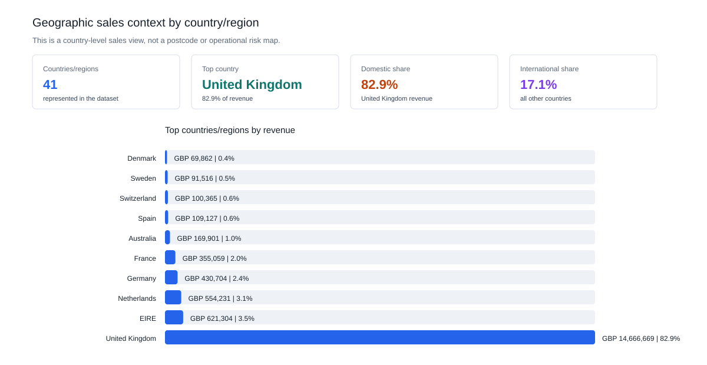
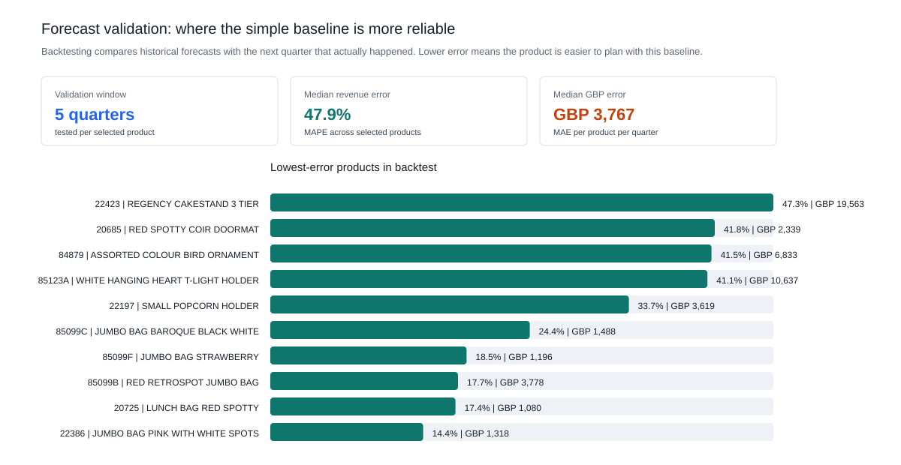
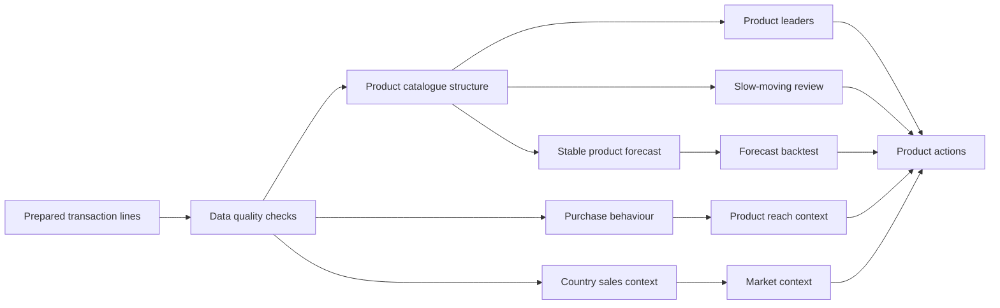

# Online Retail Product Sales, BI Reporting and Demand Planning

A UK online retailer has two years of order-line transaction history. Each row records one product line inside an invoice: what was sold, how many units were bought, when it was bought, at what price, and by which customer ID.

This project turns those transaction lines into a business-facing report and BI-ready analytical layer. The purpose is to help a retailer understand its product range, sales concentration, purchase behaviour, geographic sales context, slow-moving product risk and next-quarter planning baseline.

The management question is:

> Which products should the business protect, promote, review or forecast, based on historical sales evidence?

## What This Project Demonstrates

| Analyst capability | Evidence in this repository |
|---|---|
| Business reporting | A plain-English report that starts from management questions and ends with product actions. |
| SQL analysis | Repeatable SQL outputs for dataset overview, products, orders, customers, monthly trends, country sales and data quality. |
| BI data modelling | A proposed star schema, KPI layer and Power BI report design in [`power_bi/`](power_bi/). |
| Data quality assurance | Checks mapped to accuracy, validity, timeliness, completeness, consistency and uniqueness. |
| Visual communication | GitHub-ready SVG charts and a visual-first HTML dashboard. |
| Forecasting and validation | A next-quarter product forecast baseline plus historical backtesting. |
| Evaluation thinking | A plan for testing whether stock, bundling, clearance or promotion actions work. |

## Analysis Base

The analysis below is based on the prepared UCI Online Retail II transaction dataset.

| Analysis base | Value |
|---|---:|
| Sales period analysed | 2009-12-01 to 2011-12-09 |
| Transaction lines analysed | 793,609 |
| Completed orders analysed | 36,969 |
| Known customers represented | 5,878 |
| Merchandise products analysed | 4,626 |
| Countries/regions represented | 41 |
| Revenue analysed | GBP 17.7m |

## 1. Product Range and Planning Need

The first question is whether the retailer has a small stable product set or a broad catalogue that needs prioritisation. The answer affects stock planning, promotion planning and forecast scope.

| Management question | Evidence | Meaning |
|---|---:|---|
| How broad is the range? | 4,626 merchandise products | Product management needs prioritisation, not equal attention for every item. |
| Is there a stable core? | 1,464 products sold in 19-25 months | These products are better candidates for product-level planning and forecasting. |
| Are many products selling rarely? | 1,004 products had no sale for 365+ days | These products need lifecycle review before being kept in active planning. |
| Where is revenue concentrated? | Top 500 products generate 64.0% of merchandise revenue | Management focus should start with the products that drive most revenue. |


Interpretation:

- The retailer has a broad product catalogue, not a small fixed product set.
- A stable product core can be managed with stock and forecast review.
- Low-selling and inactive products should be managed through lifecycle rules, not manual attention product by product.

## 2. Customer and Purchase Behaviour

The dataset contains customer IDs, so customer analysis is limited to observed purchase behaviour: repeat status, order frequency, order value and basket size.

| Behaviour metric | Finding |
|---|---:|
| Known customers | 5,878 |
| One-time customers | 1,623 |
| Repeat customers | 4,255 |
| Repeat customer share | 72.4% |
| Median orders per customer | 3 |
| Median customer revenue | GBP 887 |
| Median order value | GBP 305 |
| Median units per order | 154 |
| Median distinct products per order | 15 |


Interpretation:

- Most known customers placed more than one order, so demand is not only driven by one-off buyers.
- Orders are often multi-item baskets: the median order contains 15 distinct products.
- Product reach matters. A product bought by many customers and appearing in many orders is more reliable than a product driven by one unusually large order.

## 3. Geographic Sales Context

The dataset includes country/region, so the report adds a geographic sales view. This is useful for management context, but it is not a postcode-level GIS analysis because the dataset does not include location detail below country/region.

| Geographic question | Evidence | Meaning |
|---|---:|---|
| How many countries/regions are represented? | 41 | The retailer has domestic and international sales activity. |
| Where is revenue concentrated? | United Kingdom contributes 82.9% of revenue | Sales planning should start with the domestic market. |
| How large is the international share? | 17.1% of revenue | International demand exists, but should be reviewed by country before expansion decisions. |



## 4. Monthly Sales Context

Before ranking products or forecasting demand, the business needs to understand the overall sales pattern.


Interpretation:

- Monthly revenue and order volume are not flat.
- Product decisions should consider timing and seasonality, especially for slow-moving products and next-quarter planning.
- A product with weak recent sales should not be judged only from total historical sales.

## 5. Product Leaders

Top products are reported in two different ways because high unit volume and high revenue answer different management questions.

### Top 10 by Units Sold

This answers: which products physically sold the most?


| Rank | Stock code | Product | Units sold | Revenue | Orders | Customers |
|---:|---|---|---:|---:|---:|---:|
| 1 | 84077 | WORLD WAR 2 GLIDERS ASSTD DESIGNS | 108,929 | GBP 24,844 | 920 | 482 |
| 2 | 85099B | RED RETROSPOT JUMBO BAG | 94,809 | GBP 170,298 | 3,260 | 978 |
| 3 | 85123A | WHITE HANGING HEART T-LIGHT HOLDER | 93,577 | GBP 251,887 | 4,895 | 1,490 |
| 4 | 21212 | PACK OF 72 RETROSPOT CAKE CASES | 91,175 | GBP 44,019 | 2,508 | 1,115 |
| 5 | 23843 | PAPER CRAFT, LITTLE BIRDIE | 80,995 | GBP 168,470 | 1 | 1 |
| 6 | 84879 | ASSORTED COLOUR BIRD ORNAMENT | 79,694 | GBP 126,704 | 2,652 | 1,010 |
| 7 | 22197 | SMALL POPCORN HOLDER | 77,933 | GBP 59,069 | 1,752 | 601 |
| 8 | 23166 | MEDIUM CERAMIC TOP STORAGE JAR | 77,916 | GBP 81,417 | 195 | 138 |
| 9 | 17003 | BROCADE RING PURSE | 71,093 | GBP 14,817 | 387 | 215 |
| 10 | 21977 | PACK OF 60 PINK PAISLEY CAKE CASES | 55,101 | GBP 26,656 | 1,578 | 767 |

### Top 10 by Revenue

This answers: which products matter most commercially?


| Rank | Stock code | Product | Revenue | Units sold | Orders | Customers |
|---:|---|---|---:|---:|---:|---:|
| 1 | 22423 | REGENCY CAKESTAND 3 TIER | GBP 285,992 | 24,858 | 3,317 | 1,314 |
| 2 | 85123A | WHITE HANGING HEART T-LIGHT HOLDER | GBP 251,887 | 93,577 | 4,895 | 1,490 |
| 3 | 85099B | RED RETROSPOT JUMBO BAG | GBP 170,298 | 94,809 | 3,260 | 978 |
| 4 | 23843 | PAPER CRAFT, LITTLE BIRDIE | GBP 168,470 | 80,995 | 1 | 1 |
| 5 | 84879 | ASSORTED COLOUR BIRD ORNAMENT | GBP 126,704 | 79,694 | 2,652 | 1,010 |
| 6 | 47566 | PARTY BUNTING | GBP 103,803 | 23,591 | 2,077 | 894 |
| 7 | 23166 | MEDIUM CERAMIC TOP STORAGE JAR | GBP 81,417 | 77,916 | 195 | 138 |
| 8 | 22086 | PAPER CHAIN KIT 50'S CHRISTMAS | GBP 79,456 | 29,430 | 1,691 | 896 |
| 9 | 79321 | CHILLI LIGHTS | GBP 72,528 | 15,658 | 922 | 304 |
| 10 | 22386 | JUMBO BAG PINK WITH WHITE SPOTS | GBP 68,377 | 37,680 | 1,767 | 601 |

Management reading:

- High unit volume does not always mean high revenue. `84077` sells the most units but generates much less revenue than the top revenue products.
- `23843` is an unusual case: it has high units and revenue but appears in only one order from one customer. It should be reviewed before being treated as a normal bestseller.
- `85123A` is strong across units, revenue, orders and customers, making it a broad-demand product.

## 6. Slow-Moving Product Review

Slow-moving products are not simply low sellers. This report flags products with meaningful historical revenue but no sale for at least 180 days.


Recommended review questions:

- Is the product discontinued?
- Was it out of stock?
- Is it seasonal?
- Is there remaining inventory that should be cleared, bundled or repositioned?
- Should it be removed from active planning assumptions?

The generated list is in [`outputs/slow_moving_product_candidates.csv`](outputs/slow_moving_product_candidates.csv).

## 7. Next-Quarter Forecast and Validation

Forecasting every product would be misleading because many products are sparse, seasonal or discontinued. This project forecasts only stable high-revenue merchandise products.

The current baseline uses the average of the last four quarters. For the top 20 stable products, the next-quarter baseline for 2012-Q1 is:

| Forecast scope | Baseline |
|---|---:|
| Products forecast individually | 20 |
| Forecast units | 76,320 |
| Forecast revenue | GBP 205,589 |


The forecast is also backtested against historical quarters. This matters because a planning baseline should be challenged before being used.

| Validation metric | Result |
|---|---:|
| Validation window | 5 quarters per selected product |
| Median product-level revenue MAPE | 47.9% |
| Median product-level revenue MAE | GBP 3,767 |



Interpretation:

- The baseline is useful as a first planning view, not as an automated purchasing model.
- Products with lower backtest error are stronger candidates for simple stock planning.
- Products with high error need manual review for seasonality, one-off demand, discontinuation or stock availability.

## Recommendation

The business should manage products in four groups:

1. **Protect stock for high-revenue, broad-reach products.** These products drive income and appear across many orders/customers.
2. **Use high-unit lower-revenue products for baskets and bundles.** They can increase order size even when they are not premium revenue drivers.
3. **Review slow-moving products before discounting or delisting.** Transaction data shows lack of recent sales, but not whether the cause is stockout, discontinuation or weak demand.
4. **Forecast stable products individually and manage low-selling items by rules.** The full catalogue is too sparse for reliable product-by-product forecasting.

## Product Action Groups

The interactive dashboard uses action groups to translate product metrics into management decisions. Products are grouped by revenue, sales stability, customer/order reach and recent sales activity:

- **Protect**: high-revenue products with broad customer or order reach; prioritise availability and supplier review.
- **Forecast**: stable high-revenue products with enough sales history for product-level demand forecasting.
- **Bundle**: high-unit or basket-friendly products that can support cross-sell or promotion planning.
- **Review**: slow-moving or inactive products that need lifecycle, seasonality or stockout checks before discounting or delisting.
- **Monitor**: products that remain in the catalogue but do not yet require a specific protect, forecast, bundle or review action.

## Power BI Portfolio Layer

This repository includes a Power BI design pack so the project can be presented as a BI analyst portfolio piece, not only a code project:

- [`power_bi/README.md`](power_bi/README.md) - recommended Power BI pages and user workflow.
- [`power_bi/data_model.md`](power_bi/data_model.md) - proposed fact/dimension model.
- [`power_bi/measures.md`](power_bi/measures.md) - KPI and DAX measure definitions.
- [`power_bi/report_pages.md`](power_bi/report_pages.md) - page-by-page dashboard design.

The HTML dashboard is available at [https://kaidxc.github.io/online-retail-product-sales-analysis/dashboard/product_sales_dashboard.html](https://kaidxc.github.io/online-retail-product-sales-analysis/dashboard/product_sales_dashboard.html). It is visual-first; detailed records remain in CSV outputs.

## Data Quality and Reproducibility

Before analysis, the prepared table is checked across six data quality dimensions.

| Dimension | Check | Result |
|---|---|---|
| Accuracy | Line value matches quantity times price | Pass |
| Validity | Transaction values are positive and usable | Pass |
| Timeliness | No transactions after the analysis date | Pass |
| Completeness | Required fields are populated | Pass |
| Consistency | Invoices map to one customer | Pass |
| Uniqueness | No exact duplicate transaction lines | Pass |

Generated results: [`outputs/data_quality_checks.csv`](outputs/data_quality_checks.csv).

## Analytical Outputs

Main outputs:

- [`outputs/product_performance.csv`](outputs/product_performance.csv) - product-level units, revenue, orders, customers and active months.
- [`outputs/order_purchase_summary.csv`](outputs/order_purchase_summary.csv) - one row per invoice with order value, units and distinct products.
- [`outputs/customer_profile_summary.csv`](outputs/customer_profile_summary.csv) - customer purchase-behaviour distributions.
- [`outputs/purchase_behavior_summary.csv`](outputs/purchase_behavior_summary.csv) - order-value and basket-size distributions.
- [`outputs/country_sales_context.csv`](outputs/country_sales_context.csv) - country/region revenue, orders, customers and market group.
- [`outputs/product_revenue_concentration.csv`](outputs/product_revenue_concentration.csv) - Top 10/50/100/500 revenue concentration.
- [`outputs/top_products_by_quantity.csv`](outputs/top_products_by_quantity.csv) - Top 10 merchandise products by units sold.
- [`outputs/top_products_by_revenue.csv`](outputs/top_products_by_revenue.csv) - Top 10 merchandise products by revenue.
- [`outputs/slow_moving_product_candidates.csv`](outputs/slow_moving_product_candidates.csv) - products with historical revenue but no recent sales.
- [`outputs/product_next_quarter_forecast.csv`](outputs/product_next_quarter_forecast.csv) - next-quarter baseline for stable high-revenue products.
- [`outputs/product_forecast_backtest.csv`](outputs/product_forecast_backtest.csv) - validation results for the four-quarter baseline method.
- [`outputs/executive_summary.md`](outputs/executive_summary.md) - generated executive summary.

## Data-to-Decision Workflow



## Reproduce the Analysis

The build expects the prepared transaction file from the companion data cleaning project by default:

```text
../SQL_Study_package/day1_customer_retention_learning_pack/outputs/clean_transactions.csv
```

Install dependencies and regenerate all outputs:

```bash
pip install -r requirements.txt
python scripts/build_online_retail_outputs.py
python -m unittest discover -s tests
```

The script generates SQL outputs, product CSVs, country context, forecast validation, SVG figures, the HTML dashboard and the executive summary.

## Limitations and Next Data Needed

- The dataset does not include demographic customer attributes such as age, gender, occupation or marketing channel.
- The dataset does not include product category, inventory, stockout, cost, margin or promotion fields.
- Revenue is used instead of profit because product cost and margin are not available.
- Products with weak recent sales may be discontinued, seasonal or out of stock; transaction history alone cannot separate these causes.
- Country is available, but postcode or store/station-level location is not available, so the geographic page is country-level context rather than detailed GIS analysis.
- Forecasting is limited to stable high-revenue products; sparse low-selling products should be managed by category or lifecycle rules.
