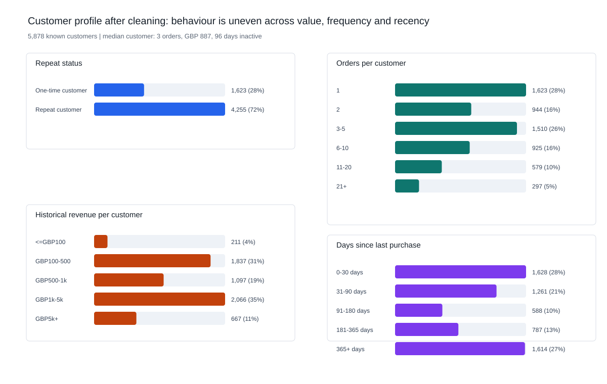
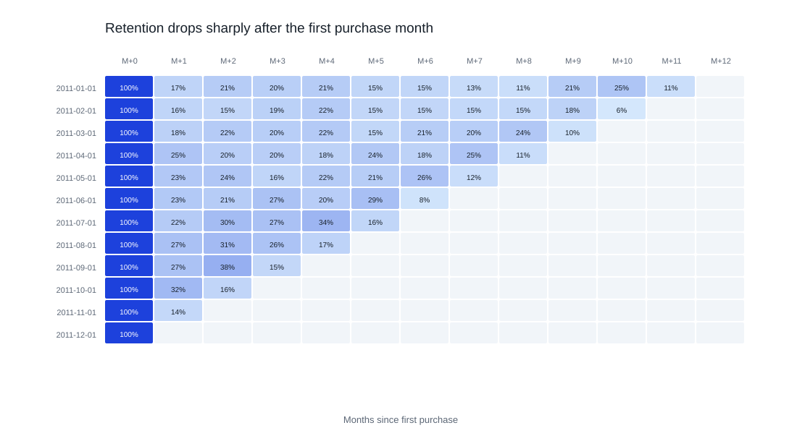
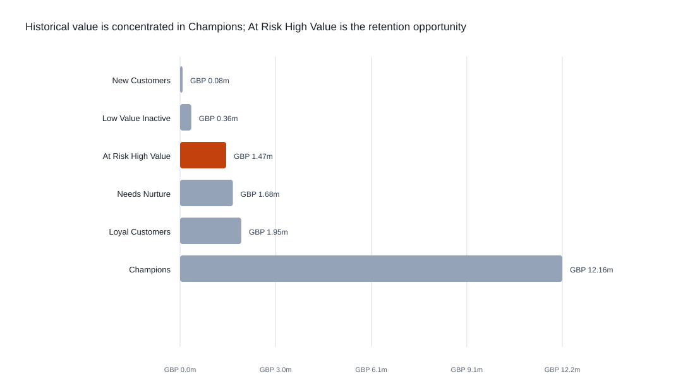
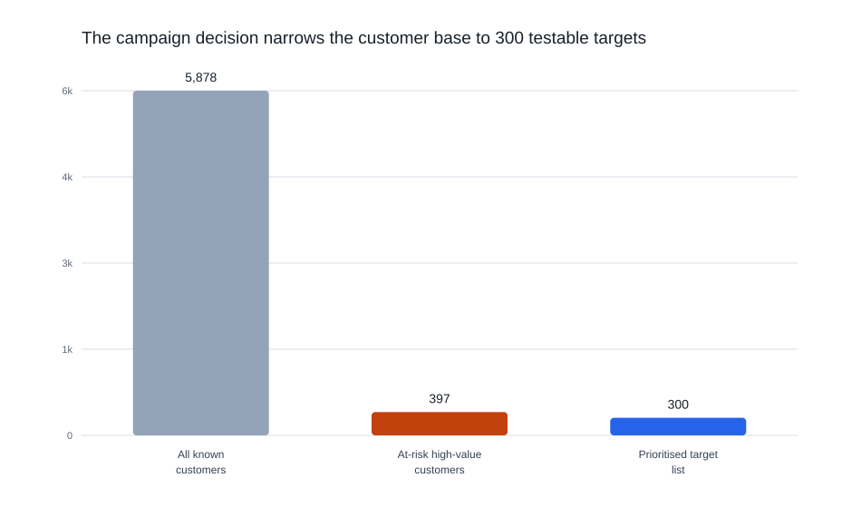
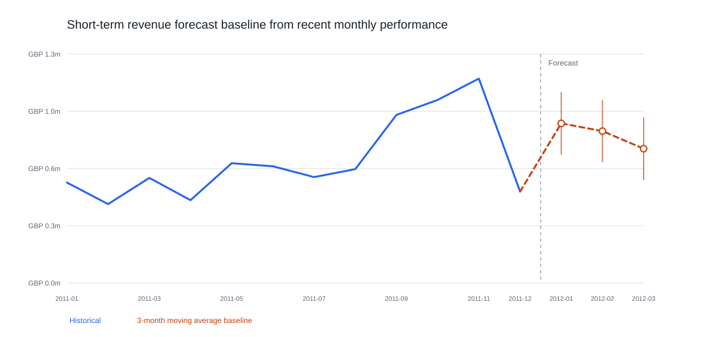
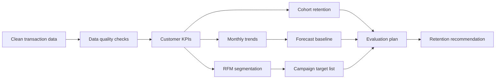

# Customer Retention Prioritisation: Who Should Be Contacted First?

A UK online retailer has two years of transaction history and a familiar commercial problem: some customers have stopped buying, but a retention campaign cannot target everyone. The useful question is not simply what happened in the past. It is:

> Which existing customers should be prioritised first, and how should the business measure whether the campaign worked?

This analysis turns cleaned transaction data into customer-level KPIs, retention evidence, a ranked campaign list and an evaluation plan.

## The data

The project uses the UCI Online Retail II dataset, a historical transaction dataset from a UK-based online retailer. Each row is a transaction line rather than a complete order. The fields include invoice ID, product, quantity, transaction date, unit price, customer ID and country.

The analysis uses a cleaned customer-level version of the data:

| Dataset feature | Value |
|---|---:|
| Transaction period | 2009-12-01 to 2011-12-09 |
| Clean transaction rows | 793,609 |
| Distinct orders | 36,969 |
| Known customers | 5,878 |
| Clean revenue | GBP 17.7m |
| Analysis date | 2011-12-10 |

Cancelled or unusable records were removed before analysis, including rows with missing customer IDs, non-positive quantities or prices, duplicate transaction lines and records that could not support customer-level targeting. The source and cleaning notes are in [`data/README.md`](data/README.md), and field definitions are in [`documentation/data_dictionary.md`](documentation/data_dictionary.md).

## From transactions to customer profiles

The raw data records what was bought. The decision needs to understand who the customers are. The analysis therefore restructures transaction lines into customer-level profiles.

| Layer | What it represents | Example fields |
|---|---|---|
| Transaction line | One product line within an invoice | invoice ID, product, quantity, unit price, line value |
| Order | One completed customer purchase | invoice ID, customer ID, order date, order value |
| Customer profile | One row per customer for decision-making | total orders, total revenue, average order value, first purchase, last purchase, days since last purchase, repeat flag |
| Campaign target | A prioritised customer for testing | priority rank, customer ID, value, inactivity, target reason |

The key customer features used in the analysis are:

- **Frequency:** how many completed orders a customer placed.
- **Monetary value:** how much revenue the customer generated historically.
- **Average order value:** typical value per completed order.
- **Recency:** how many days have passed since the customer's last purchase.
- **Repeat status:** whether the customer bought once or returned for at least one more order.
- **RFM segment:** a combined view of recency, frequency and monetary value.

## Customer profile after cleaning

The cleaned customer base contains **5,878 known customers**. It is not evenly distributed: a large group has low order frequency or long inactivity, while a smaller group contributes much higher historical value. This uneven structure is the reason a prioritisation rule is needed.



Some important patterns:

- **4,255 customers** are repeat customers, while **1,623 customers** placed only one order.
- The median customer placed **3 orders**, but the top 5% placed **21 or more** orders.
- Median customer revenue is **GBP 887**, while the top 5% generated more than **GBP 9,505**.
- Median inactivity is **96 days**, but **1,614 customers** have not purchased for more than a year.

## Recommendation

Prioritise the `At Risk High Value` segment for the first retention test.

This segment contains **397 customers** with meaningful historical spend who have not purchased recently. Together, they represent **GBP 1.47m** in historical revenue. From this group, the analysis produces a ranked list of **300 customers** as a practical test population for a retention campaign.

This recommendation is not framed as proof that a campaign will create extra revenue. It identifies the strongest starting group for a controlled test.

## How the analysis leads to the recommendation

### 1. First, check whether the data is reliable enough to use

Customer prioritisation is sensitive to bad identifiers, duplicate records and incorrect revenue values. Before building the recommendation, the cleaned analytical table is checked against six data quality dimensions.

| Dimension | Check | Result |
|---|---|---|
| Accuracy | Line value matches quantity times price | Pass |
| Validity | Transaction values are positive and usable | Pass |
| Timeliness | No transactions after the analysis date | Pass |
| Completeness | Required fields are populated | Pass |
| Consistency | Invoices map to one customer | Pass |
| Uniqueness | No exact duplicate transaction lines | Pass |

The SQL behind these checks is in [`sql/07_data_quality_checks.sql`](sql/07_data_quality_checks.sql), with generated results in [`outputs/data_quality_checks.csv`](outputs/data_quality_checks.csv).

### 2. Then, show why retention is worth investigating

Across known customers, the repeat-customer rate is **72.4%**, so repeat purchasing is an important part of the revenue base. At the same time, cohort retention weakens after the first purchase month: average month 1 to month 3 retention is **21.6%**.



This suggests that customer lifecycle behaviour matters. A useful retention action should therefore be measured over a defined post-campaign window rather than judged only by immediate sales.

### 3. Identify where value and inactivity overlap

The largest historical value sits with active `Champions`, but the better intervention opportunity is different: customers who have already shown value and are now inactive.



The `At Risk High Value` segment is selected because it combines two signals:

- high monetary value from previous purchases
- low recency, meaning the customer has not purchased recently

That makes it a clearer first test group than contacting every inactive customer or focusing only on already-active high spenders.

### 4. Turn the segment into an action list

The decision rule keeps the recommendation operational: customers must have low recency, high monetary value and at least two historical orders. The output is a ranked list that a CRM or marketing team could test.



The final list is available in [`outputs/campaign_targets.csv`](outputs/campaign_targets.csv).

### 5. Use monthly performance as context, not as the targeting rule

Monthly revenue and repeat-purchase behaviour are volatile. They help explain the trading context, but they do not tell the team which customers to contact.


For planning context, a simple 3-month moving average baseline forecasts:

| Forecast month | Revenue baseline | Repeat-purchase baseline |
|---|---:|---:|
| 2012-01 | GBP 903k | 24.5% |
| 2012-02 | GBP 859k | 24.7% |
| 2012-03 | GBP 760k | 22.1% |



The forecast is deliberately simple and transparent. It is a planning baseline, not a production forecasting model. Method notes are in [`documentation/forecasting_extension.md`](documentation/forecasting_extension.md), and the generated output is in [`outputs/monthly_forecast.csv`](outputs/monthly_forecast.csv).

## How campaign impact should be measured

Historical transaction data can identify a sensible priority group, but it cannot prove that a campaign caused customers to return. The next step should be a controlled test.

| Element | Plan |
|---|---|
| Eligible population | At Risk High Value customers with at least two previous orders |
| Test design | Random treatment/control split |
| Treatment group | Receives the retention campaign |
| Control group | Does not receive the campaign during the test window |
| Primary metric | Repeat purchase rate |
| Secondary metrics | Revenue per customer, average order value and order count |
| Guardrails | Contact cost, opt-outs, contact failures and complaints if available |

The full evaluation plan is in [`documentation/evaluation_plan.md`](documentation/evaluation_plan.md).

## Analytical methods used

| Area | What the project demonstrates |
|---|---|
| SQL analysis | Customer KPIs, RFM segmentation, cohort retention, campaign targets and data quality checks |
| KPI design | Revenue, orders, customers, AOV, repeat purchase rate, recency and retention |
| Data quality | Accuracy, validity, timeliness, completeness, consistency and uniqueness checks |
| Forecasting | Moving-average baseline, backtest error and practical forecast bands |
| Evaluation | Treatment/control design and clear causality limitations |
| Reporting | Plain-language recommendation supported by charts, outputs and reproducible logic |

More detail is in [`documentation/skills_demonstrated.md`](documentation/skills_demonstrated.md).

## Data-to-decision workflow



## Key outputs

- [`outputs/executive_summary.md`](outputs/executive_summary.md) - generated one-page decision summary.
- [`dashboard/customer_retention_dashboard.html`](dashboard/customer_retention_dashboard.html) - generated HTML dashboard.
- [`outputs/customer_profile_summary.csv`](outputs/customer_profile_summary.csv) - customer feature distributions used in the profile overview.
- [`outputs/campaign_targets.csv`](outputs/campaign_targets.csv) - ranked list of 300 campaign candidates.
- [`outputs/rfm_segment_summary.csv`](outputs/rfm_segment_summary.csv) - segment-level customer and revenue summary.
- [`outputs/monthly_kpis.csv`](outputs/monthly_kpis.csv) - monthly revenue, order, customer, AOV and repeat-purchase KPIs.
- [`outputs/monthly_forecast.csv`](outputs/monthly_forecast.csv) - short-term forecast baseline.
- [`outputs/data_quality_checks.csv`](outputs/data_quality_checks.csv) - generated quality checks.

## Reproduce the analysis

The build expects the cleaned transaction file from the companion cleaning project by default:

```text
../SQL_Study_package/day1_customer_retention_learning_pack/outputs/clean_transactions.csv
```

Run:

```bash
pip install -r requirements.txt
python scripts/build_customer_retention_outputs.py
```

The script generates the SQL outputs, executive summary, dashboard and SVG figures.

## Repository map

```text
sql/                 SQL transformations and quality checks
scripts/             reproducible output, forecast, dashboard and chart generation
outputs/             CSV extracts, metrics, forecast and executive summary
documentation/       business brief, data dictionary, analysis notes and application-ready explanations
dashboard/           generated HTML dashboard
data/                source and cleaning notes
```

## Limitations and next steps

- Transaction history shows association, not campaign causality.
- Revenue is used instead of profit because margin and campaign cost are not available.
- Channel permissions, contact history and campaign history are not available.
- The forecast is a transparent baseline, not a production model.
- A production version would add margin, contact permissions, campaign cost, customer consent, Power BI deployment and a persisted CRM-ready table.
